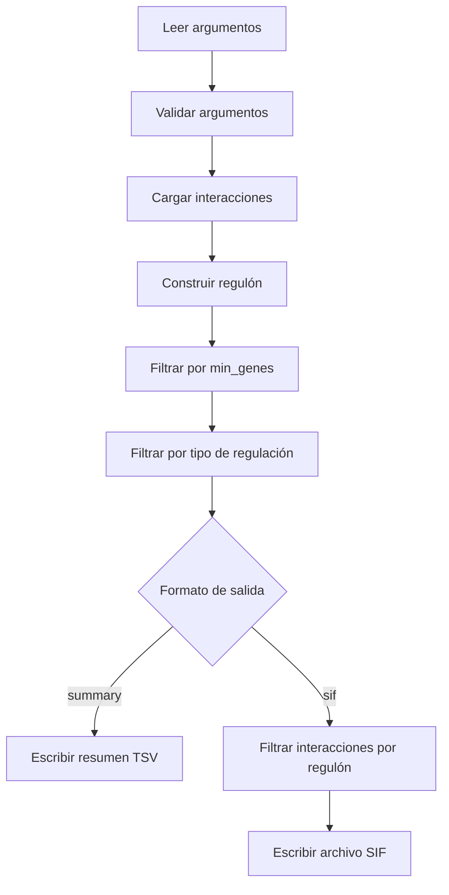

# Proyecto Regulon Summary

## Objetivo

Construir un programa que procese un archivo TSV de interacciones regulador-gen y genere un resumen de regulones por factor de transcripción.

## Requisitos funcionales

1. Leer un archivo de interacciones.
2. Construir un regulón por factor de transcripción (TF).
3. Permitir filtrar TFs por número mínimo de genes regulados (`--min_genes`).
4. Permitir filtrar TFs por tipo de regulación (`--type activador|represor|dual`).
5. Permitir seleccionar el formato de salida con `--format summary|sif`.
6. Mantener el comportamiento actual en `summary` y agregar el formato `sif`.
7. Manejar errores de archivo legibles y de escritura.
8. Mostrar advertencias cuando no haya interacciones válidas o cuando no queden TFs después del filtrado.

## Diseño técnico

### Funciones principales

- `load_interactions(filename)`
  - Lee el archivo TSV de entrada.
  - Ignora líneas vacías, comentarios y encabezados.
  - Valida que cada línea tenga suficientes columnas.
  - Devuelve una lista de tuplas `(TF, gen, efecto)`.

- `build_regulon(interactions)`
  - Construye el regulón a partir de las interacciones.
  - Para cada TF, acumula la lista de genes regulados y los conteos de activados/reprimidos.

- `filter_by_min_genes(regulon, min_genes)`
  - Conserva solo los TFs que regulan al menos `min_genes` genes.

- `get_regulator_type(data)`
  - Determina si un TF es `activador`, `represor` o `dual`.
  - Se basa en los conteos `activados` y `reprimidos`.

- `filter_by_type(regulon, regulator_type)`
  - Conserva solo los TFs cuyo tipo coincide con el filtro solicitado.

- `write_summary(regulon, output_file)`
  - Escribe un archivo TSV con el resumen del regulón.
  - Incluye el tipo de regulación y la lista de genes.

- `write_sif(interactions, output_file)`
  - Escribe las interacciones en formato SIF compatible con Cytoscape.

- `parse_arguments()`
  - Define y parsea los argumentos de línea de comandos.

- `main()`
  - Coordina el flujo completo del programa.

### Flujo del programa

1. Leer argumentos de línea de comandos.
2. Validar valores como `--min_genes`.
3. Cargar interacciones desde el archivo de entrada.
4. Construir el regulón.
5. Aplicar filtros:
   - `--min_genes`
   - `--type`
6. Si el formato es `summary`, escribir el resumen.
7. Si el formato es `sif`, filtrar interacciones por los TFs que quedaron y escribir SIF.

### Diagrama de flujo

### Estructura de datos

- `interactions`: lista de tuplas `(TF, gen, effect)`.
- `regulon`: diccionario con clave TF y valor:
  - `genes`: lista de genes únicos.
  - `activados`: conteo de activaciones.
  - `reprimidos`: conteo de represión.

### Comportamientos especiales

- Si no hay interacciones válidas, se muestra una advertencia.
- Si después del filtrado el regulón queda vacío, se muestra otra advertencia.
- El programa debe crear directorios de destino cuando sea necesario.
- Las salidas deben respetar los filtros en ambos formatos.

## Consideraciones de mantenimiento

- Separar responsabilidades ayuda a extender el programa sin duplicar lógica.
- `get_regulator_type()` centraliza la definición de `activador`, `represor` y `dual`.
- `write_sif()` recibe interacciones porque el formato SIF es una lista de relaciones, no un resumen agregado.
- El proyecto puede ejecutarse dentro de un entorno virtual tradicional o usando `uv` para sincronizar paquetes y ejecutar el script.
- Las dependencias deben gestionarse desde `pyproject.toml`; para instalar o sincronizar el entorno usa `uv sync`, no `uv add`.

## Posible evolución

En siguientes pasos, se podría reorganizar el código en módulos separados:

- `src/io.py`
- `src/core.py`
- `src/filters.py`
- `src/exporters.py`
- `src/cli.py`
- `src/regulon_summary.py`
